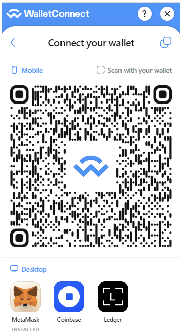
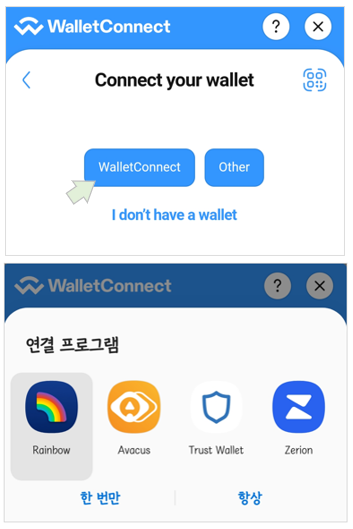

## WalletConnect V2

지갑은 이더리움에 전송하는 트랜잭션에 전자서명을 하는 기능을 제공해주기 때문에 "Web3" 애플리케이션에서는
필수적인 요소입니다. dapp을 개발하면서 지갑의 기능까지 구현하는 것은 번거로운 일이고, 해당 애플리케이션만 쓸 수 있는 지갑을
별도로 만드는 것도 소모적인 일이 될 수 있습니다.

웹브라우저나 모바일 환경에서 일관성 있는 UI/UX로 dapp에 적용되기 위해서는 어느정도 합의된 표준(EIP-1193)이 필요한데, 현재
데스크탑 환경에서는 메타마스크, 그리고 다수의 모바일 지갑들이 표준을 준수한 구현체를 제공합니다.

[WalletConnect](https://docs.walletconnect.com/2.0/)는 "지갑"과 dapp을 연결시켜주는 오픈 프로토콜로, 
dapp이 다수의 지갑을 지원하도록 해주는 라이브러리입니다. 특히 [Web3Modal](https://web3modal.com)은 WalletConnect를 기반으로 
여러 지갑을 쉽게 dapp에 적용할 수 있게 해주는 패키지입니다.

WalletConnect는 2023년 6월 이후에 현재 사용되는 V1의 서비스를 종료할 [계획](https://medium.com/walletconnect/weve-reset-the-clock-on-the-walletconnect-v1-0-shutdown-now-scheduled-for-june-28-2023-ead2d953b595)으로 있으며, V2의 개발이 진행 중에 있습니다. 
이미 V2를 적용한 지갑들이 있는데, 지원되는 지갑들은 다음 [사이트](https://explorer.walletconnect.com/)에서 확인 가능합니다(메타마스크 모바일은 아직 지원하지 않음).

WalletConnect V2는 꼭 이더리움만 지원하는 것은 아니고 "chain agnostic"으로 다양한 블록체인에 적용될 수 있는 
프로토콜로 설계되었습니다.

### Web3Modal

여기서는 Web3Modal V2의 react를 사용한 간단한 예제를 만들었습니다(V2는 아직 진행 중이기 때문에 호환성을 보장하지 않는 
변경이 발생할 수 있음). 이 예제는 다음과 같은 버전을 사용합니다.

```
react": "^18.2.0
"@web3modal/ethereum": "^2.2.0"
"@web3modal/react": "^2.2.0"
"ethers": "^5.7.2"
"wagmi": "^0.12.6"    
```

Web3Modal은 ethers.js와 함께 [wagmi](https://wagmi.sh/)라는 리액트용 라이브러리를 함께 사용해야 합니다.
체인과 지갑 "클라이언트" 설정에 wagmi가 제공하는 `configureChains`과 `createClient`를 이용합니다.

```javascript
const { provider, webSocketProvider, chains } = configureChains(
    [ mainnet, goerli, sepolia ],
    [ w3mProvider({ projectId: PROJECT_ID }) ]
);
```
`configureChains`에서는 연결할 체인과 체인에 트랜잭션을 보낼 때 사용할 "provider"를 설정합니다. 기본적으로는 
Web3Modal이 제공하는 provider `w3mProvider`를 사용할 수 있지만 여기서는 웹소켓을 쓰기 위해 알케미를 provider로 설정하기로 합니다.
다수의 provider를 설정할 수 있는데 문서에 의하면 다중 provider를 설정하면, 장애 발생시 fallback이 된다고 합니다.

```javascript
const { provider, webSocketProvider, chains } = configureChains(
    [ mainnet, goerli, sepolia ],
    [ jsonRpcProvider({
          rpc: (chain) => getJsonRpcProviders(chain.id)
      }) 
    ]
);
```
`getJsonRpcProviders`에서 각 체인(여기서는 메인넷과 Görli, Sepolia)에 대한 provider를 설정합니다. 특히 웹소켓을 
사용할 것이기 때문에 다음과 같이 설정할 수 있습니다.

```javascript
{
    http: `https://eth-mainnet.g.alchemy.com/v2/${API_KEY_ALCHEMY}`,
    webSocket: `wss://eth-mainnet.g.alchemy.com/v2/${API_KEY_ALCHEMY}`
}
```
`createClient`에서는 `configureChains`에서 설정한 체인과 provider를 사용하여 dapp에 삽입할 지갑 "클라이언트"를 
만듭니다.

```javascript
const wagmiClient = createClient({
    autoConnect: true,
    connectors: [],
    provider,
    webSocketProvider
});
```
현재 모바일 지갑은 전자서명용으로, 데스크탑 웹브라우저로 연결된 dapp의 QR을 읽거나, 직접 모바일 브라우저에서 dapp에 연결하면 선택한 지갑 앱이 실행되는
구조입니다. 지갑에서 서명된 트랜잭션은 설정된 provider를 통해 체인으로 전송됩니다.

여기서 중요한 것은 `connectors`인데, 이 커넥터들이 다양한 지갑들, 그러니까 메타마스크, 트러스트, 레인보우, 렛저와 같은 
지갑을 연결하는 커넥터들입니다. Web3Modal과 연결되는 지갑들은 WalletConnect 프로토콜을 지원하는 지갑들입니다. 앞서 언급한 것처럼 
WalletConnect를 지원하는 지갑들 목록은 사이트에서 [확인](https://explorer.walletconnect.com/) 가능합니다.

이 예제에서는 데스크탑용으로(크롬 브라우저 플러그인이 제공되는) 메타마스크와 코인베이스, 렛저만 설정합니다.

```javascript
connectors: [
     ...w3mConnectors(
         {
             projectId: PROJECT_ID,
             version: 2, // WalletConnect V2
             chains
         }
     ),
     coinbaseConnector,
     ledgerConnector
]
```
`w3mConnectors`은 WalletConnect를 지원하는 모바일 지갑을 위한 커넥터입니다. `projectId`를 반드시 설정해야 하는데 
이것은 WalletConnect [클라우드](https://cloud.walletconnect.com/)에서 미리 발급받아야 하는 API 키에 해당합니다.

이렇게 설정하면 지갑 버튼을 클릭했을 때 다음과 같은 화면이 나옵니다. 모바일 지갑들은 모두 WalletConnect를 지원하므로 QR을 스캔하여 dapp에 연결할 수 있습니다.




한편 모바일에서는 다음과 같이 표시됩니다.



모바일 기기에 원래 설치된 지갑들 중 하나를 선택하여 dapp에 연결할 수 있습니다.  

wagmi의 `createClient`로 생성된 클라이언트는 다시 Web3Modal의 `EthereumClient`로 변환되어 dapp에서 지갑을 컨트롤하는데 사용됩니다. 

```javascript
const ethereumClient = new EthereumClient(wagmiClient, chains);
```

### wagmi React Hook
Web3Modal은 wagmi와 결합되어 사용되므로 wagmi react 가 제공하는 다양한 [Hook](https://wagmi.sh/react/getting-started)을 사용할 수 있습니다.
예를 들어 어떤 함수에서 계정의 정보를 참조하려면 `useAccount`를 사용하면 됩니다.

```javascript
const { address, isConnected } = useAccount();
```
또 계정이 연결되거나 종료될 때 이벤트 핸들러를 작성할 수도 있습니다.

```javascript
useAccount({
     onConnect({ address }) {
         setAddress(address);
     },
     onDisconnect() {
         setAddress("");
         setAlert("Disconnected");
     }
});
```
wagmi react는 트랜잭션 전송에서 사용할 수 있는 `usePrepareSendTransaction`와 `useSendTransaction`을 제공합니다.  
`usePrepareSendTransaction`는 트랜잭션을 미리 실행해보고 그 트랜잭션이 실행될지 여부를 판단할 수 있어서 
사용자에게 미리 알려줄 수 있습니다. 예를 들어 잔액부족, ENS 조회, baseFee < maxFeePerGas 등의 조건들을 미리 검사하여 
충족되지 않으면 UI 레벨에서 사전 조치를 취할 수 있도록 합니다. 

```javascript
const { config } = usePrepareSendTransaction({
     request: TEST_TX_OBJ,
     onError(error) {
         console.log(error.message);
         if (isConnected) setAlert(error.message);
     }
})
```
실제 트랜잭션이 전송되는 시점에 발생할 수도 있는 오류를 미리 알려주는 역할을 한다고 보면 되겠습니다. 오류가 없으면 
`useSendTransaction`에서 리턴하는 `sendTransaction`으로 트랜잭션을 전송할 수 있습니다.

```javascript
const { sendTransaction } = useSendTransaction(
        {
            ...config,
            onSuccess(tx) {
                const hash = checkTxHash(tx);                
                setTxInfo({txHash: hash, toAddress: TEST_TX_OBJ.to});
            },
            onError(error) {
               ... 
            }
        }
);
```

트랜잭션 성공 또는 오류가 발생할 때 어떤 작업을 수행하려면 `onSuccess`와 `onError`를 작성하면 됩니다. 이 예제에서는 
트랜잭션 전송 후 트랜잭션 해시를 받아서 블록에 저장되는지 여부를 모니터링하다가 블록에 저장되면 화면에 알림을 주게 됩니다.

알케미에서 제공하는 웹소켓 구독(subscription) API인 `alchemy_minedTransactions`은 
특정 트랜잭션이 블록에 저장되면 그 정보를 알려주므로 `configureChains`에서 웹소켓을 설정했습니다.

```javascript
provider.send("eth_subscribe", ["alchemy_minedTransactions", {"addresses": [{"to": ..., "from": ...}],"includeRemoved": false,  "hashesOnly": true}]);
```

컨트랙트의 함수를 호출하는 경우에도 유사한 `usePrepareContractWrite`와 `useContractWrite`가 제공됩니다. 

### 실행

알케미 API 키는 `src/web3/GetWeb3.js`에서 설정합니다. 이 예제는 메인넷(주의할 것!), Görli, Sepolia를 설정하면 됩니다.
컨트랙트 호출에서 사용되는 컨트랙트는 SimpleStorage이고 Görli, Sepolia에 각각 배포되어 있습니다.

테스트에 사용된 모바일 지갑은 [Rainbow](https://rainbow.me/)와 [Avacus](https://avacus.cc/)입니다. 두 지갑은 WalletConnect V2를 지원하고 
Görli 테스트넷에 연결할 수 있습니다.
